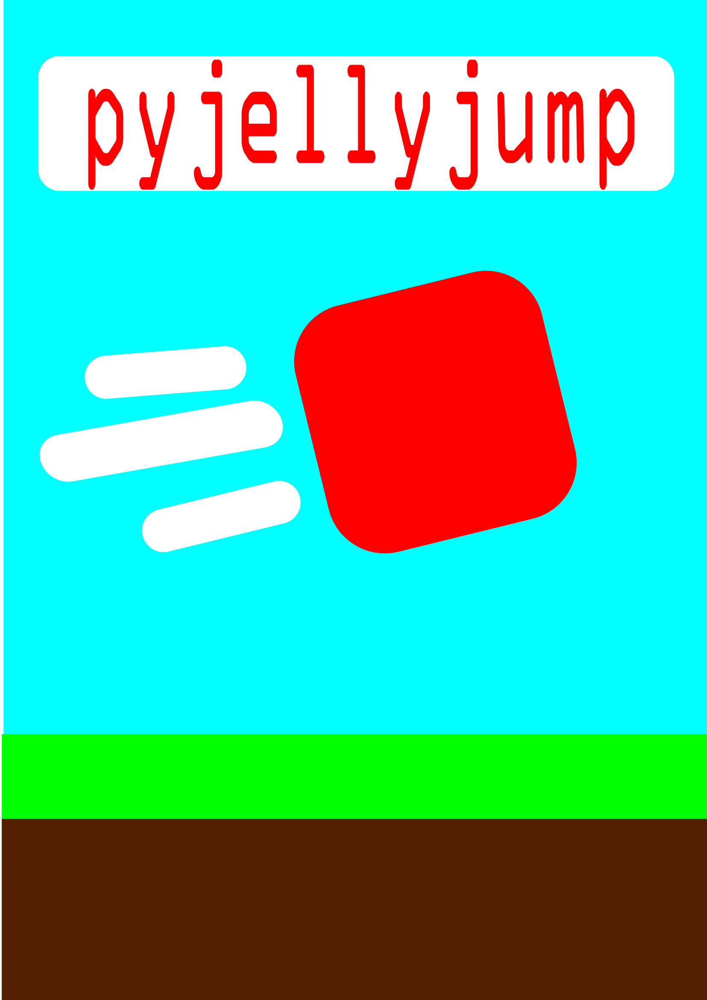

pyjellyjump is a game made with python 3/pygame, a still-in-dev, great for structures of many platformer games, there may be a few bugs, you can report it @jerrbearis2cool@gmail.com suport would be great for a developing game, phone version coming soon

<html>
  
</html>
<html>

</html>
<head>
  
</head>
<html>
  <h1>full edition(1.0.0)</h1>
  <h3>Download code</h3>
</html>
<html>
  <a href="platformer.exe" download>Download code</a>
</html>
<html>
<h3>DOWNLOAD PICTURES</h3>
</html>
<html>
  <a href="playeris2cool-1.png" download>Download player img</a>
</html>
<html>
  <a href="grassiscool-1.png" download>Download grass img</a>
</html> 
<html>
  
after downloading all the files put them all into a local file and run the exe

</html>
<html>
  <h1>One download version(0.0.0)</h1>
</html>
<html>
  <h1>Python version(0.0.0)</h1>
<html>
  <h1>credits</h1>
</html>
<html>
  
python 3, pycharm, pyinstaller, pygame

</html>
<html>
  <h1>Wait game by kevcore</h1>
<!DOCTYPE html>
<html>
<head>
  <title></title>
  
</head>
<body>
0
<canvas width="400" height="400" id="game"></canvas>

</body>
</html>
</html>

